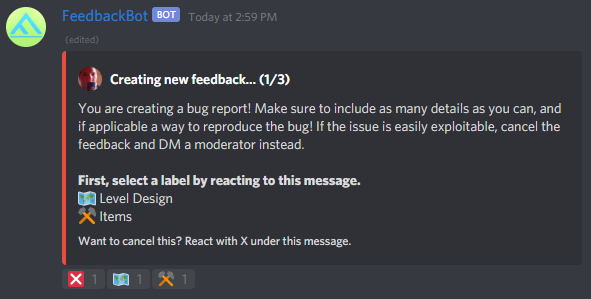
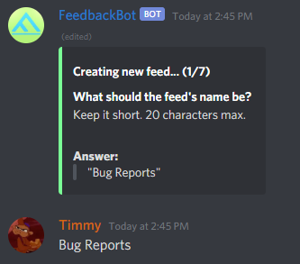
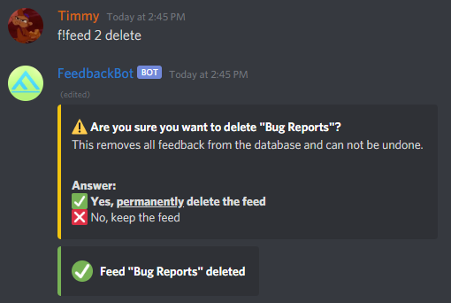

# FeedbackBot: Gathering feedback in an effective, clean and simple manner.


FeedbackBot is a Discord bot made by timraay/Abusify that allows you to streamline the process of creating and gathering feedback on a large scale.

Invite it to your server by [clicking here](https://discord.com/api/oauth2/authorize?client_id=811927151631794236&permissions=8&scope=bot)!

### License
FeedbackBot has a GNU GPLv3 license. In short, you can obtain a copy of the source code, modify it, and even distribute it. When modifying the code though, you must keep the GNU GPLv3 license. Your software should also be marked as changed, with a reference to the original source code.

# Preview
<div style="text-align:center">
With FeedbackBot you will be able to easily create feedback, whilst still making it look nice and clean. Embeds are used for that organized look, while users can still attach images and other files just fine.


Users will get a private channel when creating feedback. In here they will be asked to write their feedback, possibly select a label, and then confirm that the final result looks okay. Creating feedback can be canceled at any time by both the user and moderators.




Everything is customizable. Not only for members of your server, but also for admins it is easy to manage with clear and user-friendly commands and other actions.

<i>


Setting up a feed



Deleting the feed
</i></div>

# Docs
## All commands
```
f!help [topic]
f!new <feed>

f!feeds
f!feeds create
f!feeds <feed>
f!feeds <feed> delete
f!feeds <feed> name [new_value..]
f!feeds <feed> shortname [new_value..]
f!feeds <feed> desc [new_value..]
f!feeds <feed> color [new_value]
f!feeds <feed> channel [new_value..]
f!feeds <feed> anonymous [new_value]
f!feeds <feed> labels
f!feeds <feed> labels create
f!feeds <feed> labels <label>
f!feeds <feed> labels <label> delete
f!feeds <feed> labels <label> name [new_value..]
f!feeds <feed> labels <label> shortname [new_value..]
f!feeds <feed> labels <label> desc [new_value..]
f!feeds <feed> labels <label> color [new_value]
f!feeds <feed> labels <label> emoji [new_value]

f!triggers
f!triggers create
f!triggers <trigger>
f!triggers <trigger> delete
f!triggers <trigger> feed <value>
f!triggers <trigger> emoji <value>
f!triggers <trigger> message <value>

f!feedback <feed_id> <feedback_id>
f!export (csv|json)

f!config [option] [value]

f!invite
f!ping
```
The docs will be extended in the future. For now use the `f!help` command.